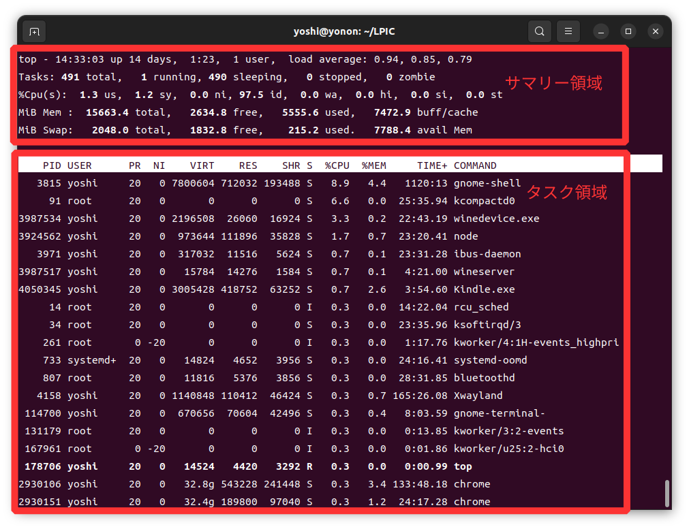
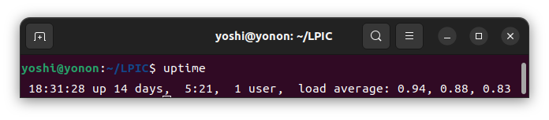

## vmstat

システムのメモリ、プロセス、割り込み、ページング、ブロックI/O、CPUの情報を表示します。

### 文法

```bash
vmstat [間隔(s) [回数]]
```

### オプション

| オプション | 説明 |
| ---------- | ---- |
| -d         | ディスクの統計情報を表示する |
| -s         | イベントカウンタとメモリの統計情報を表示する |
| -p         | 指定したパーティションの統計情報を表示する |
| -a         | メモリのアクティブ/インアクティブを表示する |
| -S         | Sの後にkまたはK、mまたはMを付けると1000、1,024、1,000,000、1,048,576バイトに出力が変わります。 |
| -w         | 大きなメモリサイズに対応するため、フィールド幅を拡大する |

### 実行例

```bash
$ vmstat 1 3
procs   -----------memory---------- ---swap-- -----io---- -system-- ------cpu-----
 r  b   swpd    free   buff   cache   si   so    bi    bo   in   cs us sy id wa st
 0  0 162464 1888624 972008 7572308    0    0     8    96   14   17 17  6 77  0  0
 0  0 162464 1896428 972008 7564304    0    0     0     0 1742 3277  1  0 99  0  0
 0  0 162464 1891780 972008 7563944    0    0     0   240 2015 4127  1  1 98  0  0
```

```bash
$ vmstat -d -w -SM
disk- -------------------reads------------------- -------------------writes------------------ ------IO-------
          total    merged     sectors          ms     total    merged     sectors          ms     cur     sec
nvme0n1  601772    123291    34476461      220478   9635078   9738776   444943858    18905783       0    8533
sda        6694         0       37194       56228         0         0           0           0       0      63
sdb        4839     36711       76258       86326         2         1           3           2       0      12
```

### 表示結果の内容

- procs
    - r (runnable: 実行可能) : 待ち状態となっている実行可能プロセス数
    - b (block: ブロック) : 割り込みできないスリープ状態となっているプロセス数

- memory
    - swpd : 使用されているスワップの量
    - free : 未使用のメモリの量
    - buff : 使用されているバッファの量
    - cache : 使用されているキャッシュの量

- swap
    - si (swap in) : スワップからメモリに読み込まれた1秒間の平均量
    - so (swap out): メモリからスワップに書き出された1秒間の平均量

- io
    - bi (block in) : デバイスから読み込まれたブロックの1秒間の平均量
    - bo (block out) : デバイスに書き出されたブロックの1秒間の平均量

- system
    - in (interrupt) : １秒あたり割り込み回数
    - cs (context switch) : 1秒あたりのコンテキストスイッチの回数

- cpu
    - us (user) : ユーザ時間の割合
    - sy (system) : カーネル時間の割合
    - id (idle) : アイドル時間の割合
    - wa (wait) : I/O待ち時間の割合
    - st (stolen): 仮想マシンの与えた時間の割合

- reads
    - total : 正常に完了した読み込みの合計
    - merged: グループ化された読み込み(I/O)
    - sectors : 読み込みに成功したセクタ数
    - ms : 読み込みにかかった時間

- writes
    - total : 正常に完了した書き込みの合計
    - merged : グループ化された書き込み(I/O)
    - sectors : 書き込みに成功したセクタ数
    - ms : 書き込みにかかった時間

- IO
    - cur : 実行中のI/O
    - s : I/Oに費やした時間

## top

システムの全体的な使用率統計情報や、各プロセスのかつ状況を定期的に更新し、リアルタイムに表示する。

### 文法

```bash
$ top
```

### オプション

| オプション  | 説明 |
| ----------- | ---- |
| -d 間隔     | 更新する間隔（デフォルト3秒） |
| -n 回数     | 表示を繰り返す回数 |
| -U ユーザー | 指定したユーザのプロセスを表示する |
| -p PID      | 指定したPIDを表示する |
| -c          | プログラム名とコマンドラインの表示を切り替える |

### 実行例

システムの全体的な使用率統計情報を表示するサマリー領域と、実行中のプロセスを、CPU使用率の高い順に、周期的にリスト表示するタスク領域があります。



### 表示結果の内容

サマリー領域

- 1行目 top -
    - 現在時刻
    - 稼働時間
    - ログインユーザー数
    - 平均負荷（1分、5分、15分）

- 2行目 tasks:
    - タスクの総数
    - 実行中あるいは実行可能なタスク数
    - スリープしているタスク数
    - ストップしているタスク数
    - ゾンビタスク数

- 3行目 %Cpu(s):
    - ユーザモードの時間
    - システムモードの時間
    - ナイス値が変更されたプロセスのユーザモードの時間
    - アイドル時間
    - I/O終了待ちの時間
    - ハードウェア割り込みの処理時間
    - ソフトウェア割り込みの処理時間
    - ハーパーバイザの処理時間

- 4行目 MiB Mem:
    - メモリの総量
    - 未使用のメモリのサイズ
    - 使用されているメモリのサイズ
    - バッファやキャッシュに割り当て済みのメモリのサイズ

- 5行目 MiB Swap:
    - スワップ領域の総量
    - 未使用のスワップ領域のサイズ
    - 使用されているスワップ領域のサイズ
    - 物理メモリの空きサイズ

タスク領域

- PID : プロセスID
- USER : 実行ユーザ
- PR : 優先度(Priority)。低いほど優先される。
- NI : ナイス値(nice)。低いほど優先される。
- VIRT : 割り当て済みの仮想メモリ（KiB）。スワップ含む。
- RES : Resident Memory Size（KiB）。使用している物理メモリ。スワップ含まない。
- SHR : Shared Memory Size（KiB）。RESのうち、共有メモリとして使用されているメモリ。
- S : Process State Code。
    - D : 割り込み不可スリープ
    - I : アイドルカーネルスレッド
    - R : 実行中もしくは実行可能
    - S : 割り込み可能スリープ
    - T : ジョブ制御シグナルで停止
    - t : デバッガにより停止
    - Z : ゾンビプロセス
- %CPU : そのプロセスが処理を行った時間の割合。
- %MEM : RES（実際の消費メモリ）の割合。
- TIME+ : プロセスが起動してから、CPUにより処理された掃除間。(10ms)
- COMMAND : 実行プロセス名。

## uptime

システムの稼働時間や負荷平均(Load average)を表示します。

### 文法

```bash
$ uptime
```

### 実行例



### 表示結果の内容

- 現在時刻
- 稼働時間
- ログインユーザ数
- 負荷平均（1分、5分、15分）

## sar

システムアクティビティの統計情報を収集、格納、表示する。指定したインターバル、回数で統計情報を収集し、表示する。インターバル、回数をを指定しなかった場合、あるいは-fオプションを指定した場合はデータファイルの内容を表示します。

### 文法

```bash
$ sar [オプション] <間隔(秒)> <回数>
```

### オプション

| オプション  | 説明 |
| ----------- | ---- |
| -o [ファイル名] | 格納するデータファイル |
| -f [ファイル名] | 表示するデータファイル |
| -P {CPU番号&#124;ALL} | 指定したCPU番号の統計情報を表示する。|
| -n {キーワード&#124;ALL} | 指定したキーワードの統計情報を表示する。キーワード： DEV(ネットワークデバイス)、SOCK(UNIXソケット)、IP、TCP、UDP |
| -r | メモリの使用状況を表示する |
| -d | ブロックデバイスの統計情報を表示する |
| -b | I/Oと転送レートの統計情報を表示する |
| -A | すべての統計情報を表示する |

### 実行例1

1秒間隔で3回統計情報を取得する

```bash
$ sar 1 3
Linux 5.15.0-56-generic (yonon) 	2022年12月23日 	_x86_64_	(12 CPU)

12時50分29秒     CPU     %user     %nice   %system   %iowait    %steal     %idle
12時50分30秒     all      1.74      0.00      1.00      0.00      0.00     97.26
12時50分31秒     all      8.60      0.00      2.17      0.00      0.00     89.23
12時50分32秒     all      2.01      0.00      0.92      0.17      0.00     96.91
平均値:      all      4.11      0.00      1.36      0.06      0.00     94.47
```

### 表示結果の内容

| オプション  | 説明 |
| ----------- | ---- |
| %user   | CPUがユーザモードで実行していた時間の割合。 |
| %nice   | nice値が変更されたプロセスをCPUがユーザーモードで実行するのに費やした時間の割合。 |
| %system | CPUがカーネルモードで実行していた時間の割合。ハードウェア割り込みと ソフトウェア割り込みで使われた時間を含む。|
| %iowait | CPUがディスクI/O待ちをしていた時間の割合。 |
| %steal  | ハイパーバイザがゲストOSにCPUを割り当てるのに費やした時間の割合。ゲストOSがCPUを要求したが、別のゲストOSがCPUを使用していて競合が起こったときにこの値が上昇する。 |
| %idle   | CPUがアイドル状態であった時間の割合。 |

### 実行例2

1秒間隔で3回CPUの統計情報を、ALLオプションの指定ですべてのフィールドを取得する

```bash
$ sar -u ALL 1 3
Linux 5.15.0-56-generic (yonon) 	2022年12月23日 	_x86_64_	(12 CPU)

16時48分39秒     CPU      %usr     %nice      %sys   %iowait    %steal      %irq     %soft    %guest    %gnice     %idle
16時48分40秒     all      0.33      0.00      0.25      0.00      0.00      0.00      0.00      0.00      0.00     99.41
16時48分41秒     all      0.92      0.00      1.00      0.00      0.00      0.00      0.00      0.00      0.00     98.08
16時48分42秒     all      1.25      0.00      1.00      0.00      0.00      0.00      0.00      0.00      0.00     97.75
平均値:      all      0.83      0.00      0.75      0.00      0.00      0.00      0.00      0.00      0.00     98.41
```

### 表示結果の内容

| オプション  | 説明 |
| ----------- | ---- |
| %usr        | CPUがユーザモードで動作していた時間の割合。 このフィールドは仮想プロセッサで使われる時間を「含まない」。 |
| %nice       | nice値が変更されたプロセスをCPUがユーザーモードで動作していた時間の割合。 |
| %sys        | CPUがカーネルモードで動作していた時間の割合。ハードウェア割り込みと ソフトウェア割り込みで使われた時間を「含まない」。 |
| %iowait     | CPUがディスクI/O待ちをしていた時間の割合。 |
| %steal      | ハイパーバイザがゲストOSにCPUを割り当てるのに費やした時間の割合。ゲストOSがCPUを要求したが、別のゲストOSがCPUを使用していて競合が起こったときにこの値が上昇する。 |
| %irq        | CPUがハードウェア割り込みへのサービスに使った時間の割合。 |
| %soft       | CPUがソフトウェア割り込みへのサービスに使った時間の割合。 |
| %guest      | CPUが仮想プロセッサを実行するのに使った時間の割合。 |
| %gnice      | CPUがnice値が変更されたゲストを実行するのに使った時間の割合。 |
| %idle       | CPUがアイドル状態であった時間の割合。 |

### 実行例3

1秒間隔で3回メモリの統計情報を、ALLオプションの指定ですべてのフィールドを取得する。

```bash
$ sar -r ALL 1 3
Linux 5.15.0-56-generic (yonon) 	2022年12月23日 	_x86_64_	(12 CPU)

16時12分11秒 kbmemfree   kbavail kbmemused  %memused kbbuffers  kbcached  kbcommit   %commit  kbactive   kbinact   kbdirty  kbanonpg    kbslab  kbkstack   kbpgtbl  kbvmused
16時12分12秒   1649300   5699816   7075780     44.12    906964   5718328  30462960    167.97   4236168   8229916       140   6569484    688940     34416    113476    206124
16時12分13秒   1650832   5701336   7074260     44.11    906964   5718316  30462960    167.97   4235992   8226604       172   6569516    688940     34416    113476    206124
16時12分14秒   1650372   5700876   7074720     44.11    906964   5718316  30462964    167.97   4235992   8227180        52   6570096    688940     34416    113476    206108
平均値:    1650168   5700676   7074920     44.11    906964   5718320  30462961    167.97   4236051   8227900       121   6569699    688940     34416    113476    206119
```

### 表示結果の内容

| オプション  | 説明 |
| ----------- | ---- |
| kbmemfree   | 空きメモリの容量（KB） |
| kbavail     | スワップなしで新しいアプリケーションを開始するのに 利用可能なメモリ量の推定値（KB） |
| kbmemused   | メモリの使用量（KB）（マシンのメモリサイズ - kbmemfree - kbbuffers - kbcached - kbslab）   |
| %memused    | メモリ使用量の割合（％） |
| kbbuffers   | カーネルのバッファとして使用されているメモリの容量（KB） |
| kbcached    | カーネルキャッシュとして使用されているメモリの容量（KB） |
| kbcommit    | システムの動作に必要な事前に確保されているメモリの量 (RAM + swap) |
| %commit     | システムの動作に必要な事前に確保されているメモリの総メモリ量に対する割合 (RAM + swap) |
| kbactive    | アクティブなメモリの容量 (KB)。※直近で使用されたメモリ、必要のない限り再利用 (開放) されないメモリ。 |
| kbinact     | アクティブでないメモリの容量 (KB)。※直近で使用されていないメモリ、必要に応じて再利用 (開放) するメモリ。 |
| kbdirty     | ディスクに書き戻されるのを待機しているメモリの容量 (KB)。 |
| kbanonpg    | ユーザ空間ページテーブルへマップされるファイルに紐付かない (non-file backed) ページ数。 |
| kbslab      | カーネルがキャッシュデータ構造、またはカーネル自身で 使っているメモリ量（KB） |
| kbkstack    | カーネルスタック空間として使っているメモリ量（KB） |
| kbpgtbl     | ページテーブルの最下層として割り当てられるメモリ量（KB） |
| kbvmused    | 仮想アドレス空間として使っているメモリ量（KB） |

### 実行例4

1秒間隔で3回ブロックデバイスの統計情報を取得する。

```bash
$ sar -d 1 3
Linux 5.15.0-56-generic (yonon) 	2022年12月23日 	_x86_64_	(12 CPU)

14時20分06秒       DEV       tps     rkB/s     wkB/s     dkB/s   areq-sz    aqu-sz     await     %util
14時20分07秒   nvme0n1     40.00      0.00    160.00      0.00      4.00      0.09      2.33      0.80
14時20分07秒       sda      0.00      0.00      0.00      0.00      0.00      0.00      0.00      0.00
14時20分07秒       sdb      0.00      0.00      0.00      0.00      0.00      0.00      0.00      0.00


14時20分07秒       DEV       tps     rkB/s     wkB/s     dkB/s   areq-sz    aqu-sz     await     %util
14時20分08秒   nvme0n1      0.00      0.00      0.00      0.00      0.00      0.00      0.00      0.00
14時20分08秒       sda      0.00      0.00      0.00      0.00      0.00      0.00      0.00      0.00
14時20分08秒       sdb      0.00      0.00      0.00      0.00      0.00      0.00      0.00      0.00

14時20分08秒       DEV       tps     rkB/s     wkB/s     dkB/s   areq-sz    aqu-sz     await     %util
14時20分09秒   nvme0n1      2.00      0.00     36.00      0.00     18.00      0.01      5.00      1.20
14時20分09秒       sda      0.00      0.00      0.00      0.00      0.00      0.00      0.00      0.00
14時20分09秒       sdb      0.00      0.00      0.00      0.00      0.00      0.00      0.00      0.00

平均値:    nvme0n1     14.00      0.00     65.33      0.00      4.67      0.04      2.45      0.67
平均値:        sda      0.00      0.00      0.00      0.00      0.00      0.00      0.00      0.00
平均値:        sdb      0.00      0.00      0.00      0.00      0.00      0.00      0.00      0.00
```

### 表示結果の内容

| オプション  | 説明 |
| ----------- | ---- |
| tps         | 1秒あたりに物理デバイスに発行される転送回数 |
| rKB/s       | 1秒あたりにデバイスから読み込んだデータのサイズ（KB）|
| wKB/s       | 1秒あたりにデバイスから書き込んだデータのサイズ（KB）|
| dKB/s       | 1秒あたりにデバイスから破棄したデータのサイズ（KB）|
| areq-sz     | デバイスに発行したI/Oリクエストの平均サイズ（KB）|
| aqu-sz      | デバイスに発行したリクエスト平均のキューの長さ |
| await       | デバイスに発行した I/O リクエストが処理されるまでの平均時間 (ミリ秒)。 この時間には、リクエストがキューに入っている時間と、処理される時間が含まれる。 |
| %util       | デバイスに I/O リクエストが発行される経過時間の割合 (デバイスのバンド幅使用率)。 リクエストに対してデバイスがシリアルにサービスする場合、 この値が 100% に近いとデバイスの飽和が起こっている。 RAID アレイや最近の SSD のように、リクエストに対してデバイスがパラレルにサービスする場合、 この値は性能限界を反映しない。|

### 実行例5

1秒間隔で3回I/Oと転送率の統計情報を取得する。

```bash
$ sar -b 1 3
Linux 5.15.0-56-generic (yonon) 	2022年12月23日 	_x86_64_	(12 CPU)

16時34分33秒       tps      rtps      wtps      dtps   bread/s   bwrtn/s   bdscd/s
16時34分34秒      7.00      0.00      7.00      0.00      0.00     56.00      0.00
16時34分35秒      0.00      0.00      0.00      0.00      0.00      0.00      0.00
16時34分36秒      7.00      0.00      7.00      0.00      0.00     56.00      0.00
平均値:       4.67      0.00      4.67      0.00      0.00     37.33      0.00
```

### 表示結果の内容

| オプション  | 説明 |
| ----------- | ---- |
| tps         | 1 秒あたりに物理デバイスに発行される転送回数。 |
| rtps        | 1 秒あたりの物理デバイスからの読み込みリクエスト数。 |
| wtps        | 1 秒あたりの物理デバイスへの書き込みリクエスト数。 |
| dtps        | 1 秒あたりの物理デバイスへの破棄リクエスト数。 |
| bread/s     | 1 秒あたりのデバイスからの読み込みデータ量 (ブロック数) |
| bwrtn/s     | 1 秒あたりのデバイスへの書き込みデータ量 (ブロック数) |
| bdscd/s     | 1 秒あたりのデバイスへの破棄データ量 (ブロック数) |

### 実行例6

1秒間隔で3回ネットワークデバイスの統計情報を取得する。

```bash
$ sar -n DEV 1 3
Linux 5.15.0-56-generic (yonon) 	2022年12月23日 	_x86_64_	(12 CPU)

17時11分40秒     IFACE   rxpck/s   txpck/s    rxkB/s    txkB/s   rxcmp/s   txcmp/s  rxmcst/s   %ifutil
17時11分41秒        lo      2.00      2.00      0.12      0.12      0.00      0.00      0.00      0.00
17時11分41秒    enp7s0      0.00      0.00      0.00      0.00      0.00      0.00      0.00      0.00
17時11分41秒      eno1      0.00      0.00      0.00      0.00      0.00      0.00      0.00      0.00
17時11分41秒    wlp6s0      1.00      1.00      0.04      0.07      0.00      0.00      0.00      0.00

17時11分41秒     IFACE   rxpck/s   txpck/s    rxkB/s    txkB/s   rxcmp/s   txcmp/s  rxmcst/s   %ifutil
17時11分42秒        lo      0.00      0.00      0.00      0.00      0.00      0.00      0.00      0.00
17時11分42秒    enp7s0      0.00      0.00      0.00      0.00      0.00      0.00      0.00      0.00
17時11分42秒      eno1      0.00      0.00      0.00      0.00      0.00      0.00      0.00      0.00
17時11分42秒    wlp6s0      1.00      1.00      0.06      0.09      0.00      0.00      0.00      0.00

17時11分42秒     IFACE   rxpck/s   txpck/s    rxkB/s    txkB/s   rxcmp/s   txcmp/s  rxmcst/s   %ifutil
17時11分43秒        lo      2.00      2.00      0.12      0.12      0.00      0.00      0.00      0.00
17時11分43秒    enp7s0      0.00      0.00      0.00      0.00      0.00      0.00      0.00      0.00
17時11分43秒      eno1      0.00      0.00      0.00      0.00      0.00      0.00      0.00      0.00
17時11分43秒    wlp6s0      0.00      0.00      0.00      0.00      0.00      0.00      0.00      0.00

平均値:      IFACE   rxpck/s   txpck/s    rxkB/s    txkB/s   rxcmp/s   txcmp/s  rxmcst/s   %ifutil
平均値:         lo      1.33      1.33      0.08      0.08      0.00      0.00      0.00      0.00
平均値:     enp7s0      0.00      0.00      0.00      0.00      0.00      0.00      0.00      0.00
平均値:       eno1      0.00      0.00      0.00      0.00      0.00      0.00      0.00      0.00
平均値:     wlp6s0      0.67      0.67      0.04      0.05      0.00      0.00      0.00      0.00
```

### 表示結果の内容

| オプション  | 説明 |
| ----------- | ---- |
| IFACE       | 統計をレポートするネットワークインタフェースの名前。 |
| rxpck/s     | 1 秒あたりの受信パケット数。 |
| txpck/s     | 1 秒あたりの送信パケット数。 |
| rxKB/s      | 1 秒あたりの受信キロバイト数。 |
| txKB/s      | 1 秒あたりの送信キロバイト数。 |
| rxcmp/s     | 1 秒あたりの受信圧縮パケット数 (cslip など)。 |
| txcmp/s     | 1 秒あたりの送信圧縮パケット数。 |
| rxmcst/s    | 1 秒あたりの受信マルチキャストパケット数。 |
| %ifutil     | ネットワークインタフェースの利用率。 半二重インタフェースの場合の利用率は、rxkB/s と txkB/s の合計が インタフェーススピードに占める割合を計算する。 全二重インタフェースの場合は、rxkB/s と txkB/s のうちの大きい方が占める割合を計算する。 |

### 実行例7


1秒間隔で3回ネットワークデバイスwlp6s0のエラーの統計情報を取得する。

```bash
$ sar -n EDEV --iface=wlp6s0 1 3
Linux 5.15.0-56-generic (yonon) 	2022年12月23日 	_x86_64_	(12 CPU)

17時34分28秒     IFACE   rxerr/s   txerr/s    coll/s  rxdrop/s  txdrop/s  txcarr/s  rxfram/s  rxfifo/s  txfifo/s
17時34分29秒    wlp6s0      0.00      0.00      0.00      0.00      0.00      0.00      0.00      0.00      0.00

17時34分29秒     IFACE   rxerr/s   txerr/s    coll/s  rxdrop/s  txdrop/s  txcarr/s  rxfram/s  rxfifo/s  txfifo/s
17時34分30秒    wlp6s0      0.00      0.00      0.00      0.00      0.00      0.00      0.00      0.00      0.00

17時34分30秒     IFACE   rxerr/s   txerr/s    coll/s  rxdrop/s  txdrop/s  txcarr/s  rxfram/s  rxfifo/s  txfifo/s
17時34分31秒    wlp6s0      0.00      0.00      0.00      0.00      0.00      0.00      0.00      0.00      0.00

平均値:      IFACE   rxerr/s   txerr/s    coll/s  rxdrop/s  txdrop/s  txcarr/s  rxfram/s  rxfifo/s  txfifo/s
平均値:     wlp6s0      0.00      0.00      0.00      0.00      0.00      0.00      0.00      0.00      0.00
```

### 表示結果の内容

| オプション  | 説明 |
| ----------- | ---- |
| IFACE       | 統計をレポートするネットワークインタフェースの名前。 |
| rxerr/s     | 1 秒あたりの受信不良パケット数。 |
| txerr/s     | 1 秒あたりの送信エラーが起きたパケット数。 |
| coll/s      | 1 秒あたりの送信衝突 (collision) が起きたパケット数。 |
| rxdrop/s    | 1 秒あたりのドロップされた受信パケット数。Linux のバッファに空きがない場合に起こる。 |
| txdrop/s    | 1 秒あたりのドロップされた送信パケット数。Linux のバッファに空きがない場合に起こる。 |
| txcarr/s    | 1 秒あたりのキャリアエラーが起きた送信パケット数。 |
| rxfram/s    | 1 秒あたりのフレームアライメントエラーが起きた受信パケット数。 |
| rxfifo/s    | 1 秒あたりの FIFO オーバーランエラーが起きた受信パケット数。 |
| txfifo/s    | 1 秒あたりの FIFO オーバーランエラーが起きた送信パケット数。 |

## iptraf

IPネットワークモニタリングツールです。TCP/UDPなどのIPパケットのモニター、およびネットワークI/Fの統計情報などを表示します。

## pstree

現在動作しているプロセスをツリー形式で表示する。

## ps

現在動作しているプロセス一覧を表示する。

## iotop

I/Oの統計情報を表示する。
